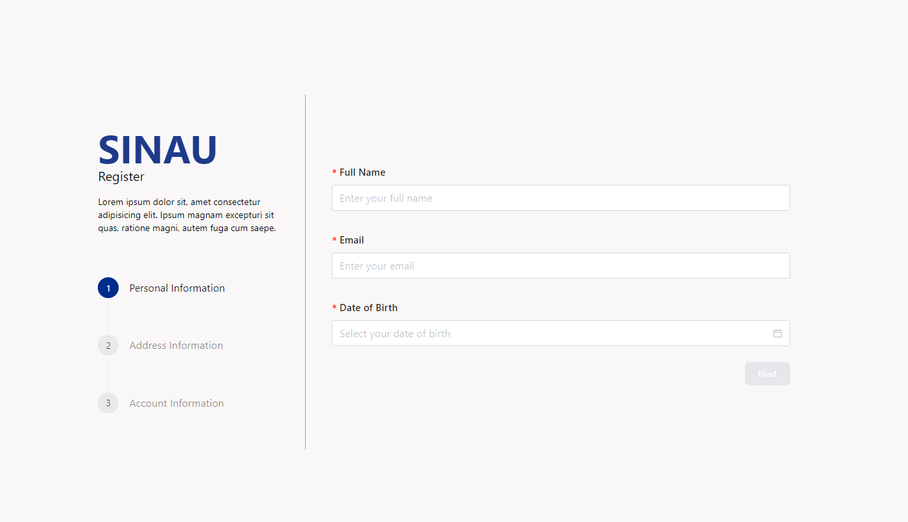
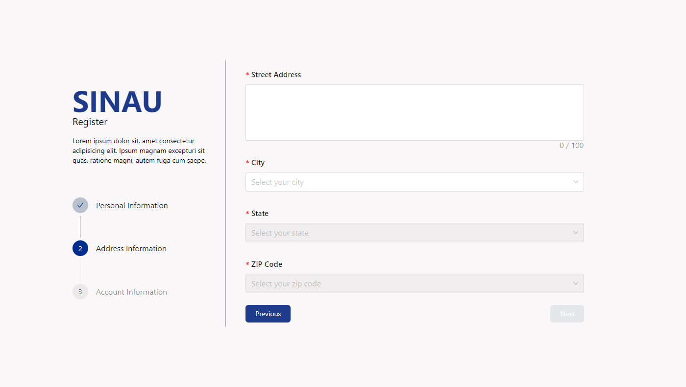
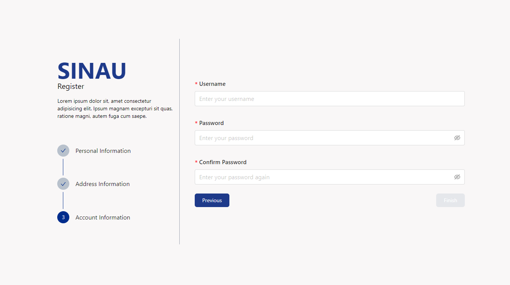
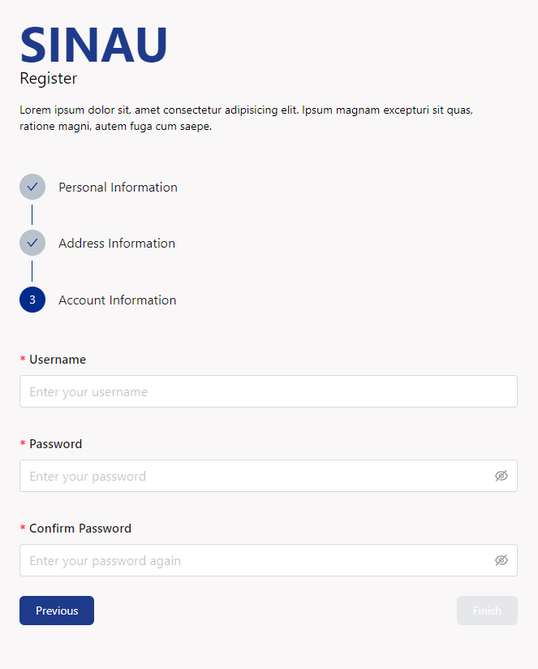

# SINAU

## Description

SINAU is a modern and minimalist online learning app that provides a wide range of courses and educational resources for students, professionals, and lifelong learners. The app features a clean and intuitive interface, making it easy to navigate and explore the available courses and learning materials. Users can sign up for an account, browse through the course catalog, enroll in specific courses, and track their progress as they complete the lessons and assignments. The app also includes a community forum where users can interact with instructors and fellow learners, ask questions, and share their knowledge and experiences. Whether you're looking to acquire new skills, advance your career, or simply pursue your passion for learning, SINAU offers a convenient and flexible platform to help you achieve your educational goals.

---

## 1. Installation

1. Clone the repository
2. Install the required dependencies using the following command:
   ```
   pnpm install
   ```
3. Start the development server using the following command:
   ```
   pnpm run dev
   ```
4. Open the app in a web browser using the following URL:
   ```
   http://localhost:5173
   ```

---

## 2. Usage

1. Open the app in a web browser
2. Navigate through the app using the navigation bar
3. Explore the features and functionalities of the app
4. Interact with the app's elements and components
5. Test the app's responsiveness and performance on different devices and screen sizes

---

## 3. Design Choices

### Colors

We used the following colors for the project:

- #F9F7F7: This light gray color creates a clean and minimalist look, providing a sense of simplicity and elegance to the app's design.
- #DBE2EF: The soft blue color creates a calming and soothing effect, which is ideal for an online learning app that aims to create a relaxed and focused learning environment.
- #3F72AF: This vibrant blue color adds a touch of energy and excitement to the app, making it visually appealing and engaging for users.
- #112D4E: The dark blue color creates a sense of depth and contrast, enhancing the readability of text and other elements on the app's interface.

### Fonts

We used the following fonts for the project:
Open Sans: This clean and modern sans-serif font is easy to read and provides a professional and polished look to the app's interface. It is suitable for both headings and body text, making it versatile and functional for various design elements.

### Layout

We used a clean and minimalist layout for the app, with plenty of white space and simple, intuitive navigation. The app's interface is designed to be user-friendly and easy to navigate, with clear and concise content that is easy to read and understand. The layout is responsive and adapts to different screen sizes, ensuring a consistent and seamless user experience across various devices and platforms.

---

## 4. Documentation

#### Step 1 - Personal Information



#### Step 2 - Address Information



#### Step 3 - Account Information



#### Mobile View



### Demonstration Video

[Here](https://drive.google.com/file/d/1XzTVE368U5xqufrI7uu3qSbpApdszmxZ/view?usp=sharing)
